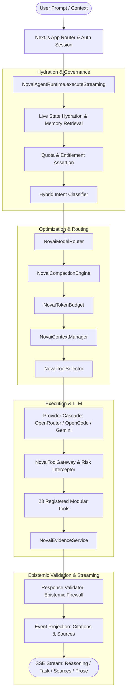
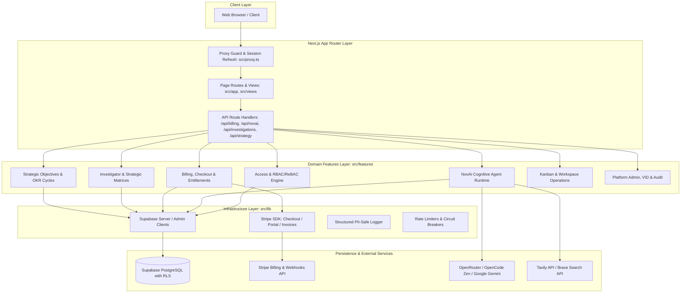

<p align="center">
   <a href="https://github.com/dtreasuresp/NovaResearch" target="_blank">
      
   </a>
</p>

<h1 align="center">
   <a href="https://github.com/dtreasuresp/NovaResearch" target="_blank" align="center">
      NovaResearch
   </a>
</h1>

   
> **Evidence-aware research, strategic analysis, and AI-assisted investigation platform.**

**NovaResearch** is a high-assurance, multi-tenant platform and application suite developed by DGTECNOVA SRL. It bridges qualitative intelligence, empirical evidence, and formal management diagnostic matrices (EFI, EFE, DAFO/SWOT, CAME, QSPM) within its core **Research** application, integrated with **NovAi** — an independent autonomous cognitive AI product engineered with epistemic guardrails, dynamic tool execution, semantic context compaction, and strict multi-provider model routing.

As a platform, NovaResearch enforces a multi-layer security model (RBAC + ReBAC + Entitlements), native PostgreSQL Row Level Security (RLS), full auditability, zero-latency database-backed billing, and grounded evidence traceability.

---

## 📑 Table of Contents

- [Product Architecture & Taxonomy](#-product-architecture--taxonomy)
- [Key Capabilities](#-key-capabilities)
- [NovAi Cognitive Agent Runtime (Independent Product)](#-novai-cognitive-agent-runtime-independent-product)
  - [Runtime Architecture](#runtime-architecture)
  - [Operational Modes](#operational-modes)
  - [Model Routing & Provider Cascade](#model-routing--provider-cascade)
  - [Semantic Context Compaction](#semantic-context-compaction)
  - [Epistemic Firewall & Response Validation](#epistemic-firewall--response-validation)
- [Tools Catalog (API & MCP Integration)](#-tools-catalog-api--mcp-integration)
- [Research Application & Evidence Engine](#-research-application--evidence-engine)
  - [Three Knowledge Boundaries](#three-knowledge-boundaries)
  - [Investigation Lifecycle & State](#investigation-lifecycle--state)
  - [Evidence Repository & Inline Citations](#evidence-repository--inline-citations)
- [Methodology & Strategic Analysis Framework](#-methodology--strategic-analysis-framework)
  - [Internal & External Factor Evaluation (EFI / EFE)](#internal--external-factor-evaluation-efi--efe)
  - [Cross-Matrix DAFO / SWOT](#cross-matrix-dafo--swot)
  - [CAME Multicriteria Action Plan](#came-multicriteria-action-plan)
  - [Quantitative Strategic Planning Matrix (QSPM)](#quantitative-strategic-planning-matrix-qspm)
  - [Formal Validation & Consistency Checks](#formal-validation--consistency-checks)
- [Strategic Execution & OKR Foundation](#-strategic-execution--okr-foundation)
- [System Architecture](#-system-architecture)
- [Project Structure](#-project-structure)
- [Security Model & Access Control](#-security-model--access-control)
  - [3-Layer Security Architecture](#3-layer-security-architecture)
  - [Hybrid 3D Authorization (RBAC + ReBAC + Entitlements)](#hybrid-3d-authorization-rbac--rebac--entitlements)
  - [Capability Manifest](#capability-manifest)
  - [Tenant Isolation & RLS](#tenant-isolation--rls)
- [Billing & Subscription Management](#-billing--subscription-management)
- [Database & Migrations](#-database--migrations)
- [Testing & Quality Assurance](#-testing--quality-assurance)
- [Development & Operations](#-development--operations)
  - [Prerequisites](#prerequisites)
  - [Environment Configuration](#environment-configuration)
  - [Available Scripts](#available-scripts)
- [Internationalization (i18n)](#-internationalization-i18n)

---

## 🌐 Product Architecture & Taxonomy

The ecosystem enforces a clear separation between the platform suite, the applications within the suite, and independent AI products:

```text
                    NovaResearch
                  Platform / Suite
                         │
                         ▼
                      Research
                Research Application
                         │
                    API / MCP
                         │
                         ▼
                       NovAi
               Independent AI Product
```

### Canonical Entity Definitions:

1. **NovaResearch**: The parent multi-tenant SaaS platform and product suite developed by DGTECNOVA SRL. It provides multi-tenant authentication, workspace isolation, team collaboration, Stripe billing, role and permission management, and digital identity verification.
2. **Research**: The flagship research and strategic diagnostic application within NovaResearch. It delivers evidence-aware investigation dossiers, factor diagnosis, quantitative matrix calculation (EFI, EFE, DAFO, CAME, QSPM), and strategy formulation.
3. **NovAi**: An **independent AI product** developed by DGTECNOVA, featuring an autonomous cognitive agent runtime, multi-provider model router, tool gateway, epistemic firewall, and semantic context engine. NovAi integrates with NovaResearch and the Research application via **API and MCP**, and can also be consumed independently by external systems. NovAi is an independent product and is never described as an internal child submodule.

---

## ✨ Key Capabilities

- **Evidence-Aware Investigation Management**: Structured dossiers with factors, qualitative and empirical evidence, relationships, cross-impact scores, and immutable revision history.
- **Deterministic Strategic Analysis Engines**: Native TypeScript calculation of Internal Factor Evaluation (**EFI**), External Factor Evaluation (**EFE**), **DAFO/SWOT** quadrant contributions, **CAME** multicriteria action scoring, and Quantitative Strategic Planning Matrix (**QSPM**) Total Attractiveness Scores (**TAS**).
- **NovAi Autonomous Agent Runtime**: Streaming SSE agent harness built on Vercel AI SDK Core (`ai`), featuring dynamic tool selection, model routing, token budgeting, and semantic conversation compaction.
- **Strict Epistemic Firewall**: 15 canonical response validation rules (§37) preventing unbacked assertions, rejecting hallucinated external verification without verified web results, and separating demonstrated facts from inferences.
- **Hybrid 3D Authorization**: Multi-tenancy guarded by RBAC (role capability bundles), ReBAC (investigation ownership and collaboration scopes), and ABAC/Entitlements (commercial limits and AI quotas).
- **Native Row Level Security (RLS)**: 100% of tenant-scoped tables protected by PostgreSQL RLS with `has_capability(auth.uid(), tenant_id, ...)` checks.
- **Zero-Latency Database-Backed Billing**: Stripe subscriptions, customer portal, invoices, and plan quotas synchronized asynchronously via webhooks into Supabase PostgreSQL, enabling zero-network-delay client queries.
- **Multilingual Support**: Fully localized in 5 languages (Spanish, English, German, Korean, Portuguese) with automated AI translation workflows.

---

## 🤖 NovAi Cognitive Agent Runtime

NovAi is not a direct LLM wrapper or simple prompt interpolator. It is a full **Agent Runtime & Harness** designed for enterprise decision-making with strict governance, auditability, and epistemic calibration.

### Runtime Architecture



### Operational Modes

NovAi operates across 7 specialized modes configured in `src/features/novai/adapters/modes.ts`:

| Mode | Title | Purpose | Model Category | Risk Level |
| :--- | :--- | :--- | :--- | :--- |
| `CHAT` | Asistente General | General assistance, platform navigation, and operational guidance. | `fast` | Low |
| `CONSULTANT` | Consultor Estratégico | Deep strategic diagnosis (EFI/EFE/DAFO/QSPM/CAME) and critical audit. | `reasoning` | Low |
| `ANALYST` | Analista de Datos | Quantitative interpretation, matrix ratios, task completion metrics. | `balanced` | Low |
| `RESEARCHER` | Investigador de Evidencias | Empirical evidence gathering, PESTEL/Porter analysis, source verification. | `reasoning` | Low |
| `DEVELOPER` | Especialista en Código | TypeScript, Next.js App Router, SQL schemas, and API integration. | `coding` | Medium |
| `ARCHITECT` | Arquitecto de Soluciones | Multi-tenant architecture, RBAC/ReBAC policies, RLS, and Stripe security. | `reasoning` | Medium |
| `OPERATOR` | Operador de Tareas | Kanban orchestration, sprint tracking, and workflow action items. | `balanced` | Low |

### Model Routing & Provider Cascade

`NovaiModelRouter` inspects conversational intent using a sliding window of recent user messages and routes execution to the most capable model tier:

1. **Coding (`DEVELOPER`)**: `poolside/laguna-s-2.1:free` (262k context, verified native tool calling).
2. **Reasoning (`CONSULTANT`, `ARCHITECT`)**: `nvidia/nemotron-3-ultra-550b-a55b:free` (1M context, deep reasoning and strategic auditing).
3. **Fast / Navigation (`CHAT`, `OPERATOR`)**: `openrouter/free` (auto-balanced low latency).
4. **Balanced / Analytics (`ANALYST`, `RESEARCHER`)**: `inclusionai/ling-3.0-flash-fin:free` (262k context, high financial/analytical precision).

**Provider Fallback Order:**
1. **OpenRouter** (Free tier with strict `X-Data-Policy: never_log` header ensuring zero training on customer data).
2. **OpenCode Zen** (`nemotron-3-ultra-free`, `mimo-v2.5-free`, `hy3-free` via `https://opencode.ai/zen/v1`).
3. **Google Gemini Native** (`gemini-3.6-flash`, `gemini-3.5-flash`).

### Semantic Context Compaction

When conversation history reaches **80% context utilization** or exceeds **40 messages**, `NovaiCompactionEngine` compresses older turns into a structured semantic snapshot (`StructuredSummary`):
- Summarizes objectives, confirmed facts, strategic decisions, constraints, active investigation IDs, evidence, conclusions, and pending questions.
- Preserves the initial anchor message, compaction notice, and the 10 most recent conversational turns.
- Persists summary metadata in `novai_conversations.metadata.compaction` with versioning and token snapshots.

### Epistemic Firewall & Response Validation

`src/features/novai/response-validator.ts` executes 15 canonical epistemic rules (§37) before streaming final completion:
- **`VERIFIABLE > TRAZABLE > INTERPRETABLE > GENERATIVE`**: Numbers and metrics must be backed by a verified `CalculationEvent` or `ToolResultEvent`.
- **Anti-Hallucination on External Research**: If a query demands external verification but no real web results were fetched, the validator blocks synthetic citations and prepends `INSUFFICIENT_EVIDENCE`.
- **Relevance vs. Credibility Separation**: Explicitly prevents search engine relevance scores (Tavily/Brave rankings) from being misrepresented as methodological credibility.
- **Honest Degradation**: Automatically downgrades unverified factual claims to `INFERENCE` or `HYPOTHESIS`.

---

## 🛠️ Tools Catalog

NovAi interacts with the platform and external world through 23 modular, server-side tools defined in `src/features/novai/tools/`. Each tool enforces tenant isolation, RLS, and principal capability checks:

### 1. Investigation & Evidence Tools

| Tool Identifier | Purpose |
| :--- | :--- |
| `list_investigations` | List accessible investigations within the active tenant under RLS and ReBAC rules. |
| `get_active_investigation` | Retrieve the currently focused or active investigation context and summary state. |
| `get_investigation_details` | Fetch full investigation state (metadata, factors, relationships, strategies, CAME, QSPM). |
| `get_investigations_stats` | Compute aggregate statistics across tenant investigations (statuses, completion rates). |
| `get_investigation_documents` | Retrieve attached documents, files, and metadata associated with an investigation. |
| `search_evidence` | Search internal evidentiary fragments and notes across investigation factors. |
| `get_factor_evidence` | Retrieve specific evidentiary backing and qualitative notes for a factor code (e.g. `F-01`, `D-02`). |
| `verify_claim` | Verify factual or analytical claims against recorded investigation evidence. |

### 2. Methodology & Audit Tools

| Tool Identifier | Purpose |
| :--- | :--- |
| `audit_factor` | Audit methodological compliance, rating scale validity (1-4), and weight justification for a factor. |
| `audit_relationship` | Validate cross-matrix factor relationships and justification consistency in quadrants (FO, DO, FA, DA). |
| `find_contradictions` | Identify logical, numerical, or qualitative contradictions across factors and matrix crossings. |
| `validate_methodology` | Run full formal validation on weight normalization ($\sum = 1.0$), factor counts, and stage consistency. |
| `calculate_matrix` | Deterministically compute official mathematical matrix indices (EFI, EFE, DAFO quadrants, CAME, QSPM TAS). |

### 3. Strategy & Red-Team Tools

| Tool Identifier | Purpose |
| :--- | :--- |
| `trace_strategy` | Trace causal lineage from proposed strategic actions back to foundational factors, crossings, and criteria. |
| `compare_strategies` | Perform multi-criteria comparative analysis between competing strategic proposals. |
| `challenge_analysis` | Execute red-team stress testing, exposing vulnerabilities, hidden assumptions, and risk exposures. |

### 4. Platform & Operations Tools

| Tool Identifier | Purpose |
| :--- | :--- |
| `list_kanban_tasks` | List and filter tasks from the workspace Kanban board by status, priority, and assignee. |
| `get_kanban_board_summary` | Summarize sprint progress, column distribution, and workload bottlenecks. |
| `list_workspace_members_and_teams` | Query tenant collaborators, teams, and organizational roles. |
| `get_tenant_billing_and_quota_info` | Retrieve tenant plan details, active entitlements, and remaining AI query quotas. |
| `record_strategic_memory` | Persist key strategic decisions, constraints, or preferences into tenant long-term memory. |

### 5. Research & External Evidence Tools

| Tool Identifier | Purpose |
| :--- | :--- |
| `web_research` | Live web search via Tavily REST API (with topic, freshness days, and domain filters) or Brave Search fallback. |
| `web_extract` | Deep markdown content extraction from 1–3 external web URLs via Tavily Extract API with token budget bounds. |

---

## 🔍 Investigation & Evidence Engine

### Three Knowledge Boundaries

NovaInvestigator enforces a strict epistemic taxonomy to eliminate confusion between sources:

```
┌─────────────────────────────────────────────────────────────────────────┐
│ 1. INTERNAL EVIDENCE (Investigation Dossier)                            │
│    Verified documents, registered factors, matrix scores, audit logs.    │
├─────────────────────────────────────────────────────────────────────────┤
│ 2. EXTERNAL EVIDENCE (Live Empirical Research)                          │
│    Live web sources (Tavily/Brave), external articles, industry data.    │
├─────────────────────────────────────────────────────────────────────────┤
│ 3. PARAMETRIC MODEL KNOWLEDGE (General Intelligence)                    │
│    Trained reasoning patterns, heuristics; classified as INFERENCE.     │
└─────────────────────────────────────────────────────────────────────────┘
```

- An external source confirming a macro trend (e.g. regulatory reform) **does not** automatically validate an internal factor without an explicit link.
- Internal evidence is authoritative for the organization; external evidence provides context.

### Investigation Lifecycle & State

Investigations progress through structured lifecycle stages (`nueva` $\rightarrow$ `borrador` $\rightarrow$ `en análisis` $\rightarrow$ `validada` $\rightarrow$ `exportada` $\rightarrow$ `cerrada`).

The complete investigation state (`InvestigationState`) includes:
- **Metadata**: Title, organization, unit, author, problem statement, objectives, assumptions, methodological version, access level (`private`, `team_read`, `team_write`), and locked status.
- **Internal Factors (`internal`)**: Strengths (`F`) and Weaknesses (`D`) with weights, ratings (1–4), descriptions, and evidence strings.
- **External Factors (`external`)**: Opportunities (`O`) and Threats (`A`) with weights, ratings (1–4), descriptions, and evidence strings.
- **Relationships (`relationships`)**: Cross-factor impact ratings (0: None, 1: Weak, 2: Moderate, 3: Strong), justifications, and evaluators.
- **Strategies (`strategies`)**: Formulated strategic initiatives mapped to DAFO quadrants.
- **QSPM Scores (`qspmScores`)**: Attractiveness scores (AS 1–4) for competing strategies against factors.
- **CAME Actions (`cameActions`)**: Tactical operational actions categorized as Corregir, Afrontar, Mantener, or Explotar.
- **Revision History (`history`)**: Delta tracking with author, timestamp, reason, and state snapshots.

### Evidence Repository & Inline Citations

- Evidentiary records are persisted in `novai_evidence` and inline citations in `novai_citations` under tenant-isolated RLS.
- Epistemic statuses: `FACT`, `INFERENCE`, `HYPOTHESIS`, `ASSUMPTION`, `UNKNOWN`.
- Source types: `internal_document`, `web_source`, `database_evidence`, `tool_derived`, `memory`.
- Citations are linked directly to factor codes and presented in the UI under collapsible source groups with visual distinction between internal documents and external web references.

---

## 📊 Methodology & Strategic Analysis Framework

NovaInvestigator implements verified mathematical calculation engines in `src/utils/investigator/domain.ts`:

### Internal & External Factor Evaluation (EFI / EFE)

- **Weight Normalization**: Internal factor weights ($\sum W_{\text{internal}} = 1.0$) and external factor weights ($\sum W_{\text{external}} = 1.0$) are normalized automatically.
- **Weighted Score Calculation**:
  $$\text{Score}_i = \text{Weight}_i \times \text{Rating}_i \quad (\text{Rating} \in [1, 4])$$
- **Total Index**: Sum of weighted scores. An index $\ge 2.5$ indicates an internally strong position (EFI) or a favorable external environment (EFE); $< 2.5$ indicates internal weakness or external vulnerability.

### Cross-Matrix DAFO / SWOT

- **Quadrants**:
  - **FO (Ofensiva)**: Maximize Strengths to exploit Opportunities.
  - **DO (Adaptativa)**: Overcome Weaknesses by exploiting Opportunities.
  - **FA (Defensiva)**: Use Strengths to neutralize Threats.
  - **DA (Supervivencia)**: Minimize Weaknesses and avoid Threats.
- **Quadrant Contribution**: Aggregates relationship strengths ($0..3$) weighted by factor weights to determine the **Dominant Quadrant** and strategic orientation.

### CAME Multicriteria Action Plan

Transforms diagnostic conclusions into concrete actions (Corregir debilidades, Afrontar amenazas, Mantener fortalezas, Explotar oportunidades) evaluated across 5 weighted criteria:

$$\text{Priority} = 0.2 \cdot \text{Impact} + 0.2 \cdot \text{Urgency} + 0.2 \cdot \text{Severity} + 0.2 \cdot \text{Alignment} + 0.2 \cdot \text{Feasibility}$$

### Quantitative Strategic Planning Matrix (QSPM)

Evaluates the relative attractiveness of alternative strategies against normalized factor weights:
- **Attractiveness Score (AS)**: 1 (Not attractive), 2 (Somewhat attractive), 3 (Reasonably attractive), 4 (Highly attractive).
- **Total Attractiveness Score (TAS)**:
  $$\text{TAS}*{s} = \sum*{f} (\text{NormalizedWeight}*f \times \text{AS}*{f, s})$$
- Automatically detects winning strategies, score differences, ties, and flags uncompleted factor evaluations.

### Formal Validation & Consistency Checks

The `validateInvestigation` engine checks:
- Exact weight sums equal to $1.0$.
- Minimum and maximum factor thresholds.
- Unassigned relationships or missing justifications.
- Incomplete CAME actions or unrated QSPM factors.

---

## 🎯 Strategic Execution & OKR Foundation

NovaResearch now provides the first normalized layer for strategic execution
without duplicating Research's CAME model:

- `strategic_objectives` stores durable, tenant-scoped objectives and can
  retain the originating Research investigation and CAME action snapshot.
- `okr_cycles` stores independent quarterly, annual or custom periods. Multiple
  cycles may coexist by tenant, workspace or team.
- `okr_cycle_objectives` records the cycle-specific commitment, weight,
  responsible user, status and progress for each objective.
- Existing Projects can reference a strategic objective through the nullable
  `strategic_objective_id` relationship; the legacy text field remains
  backward-compatible during the incremental rollout.

The lifecycle is governed server-side (`draft → active → closed → archived`)
with optimistic locking, tenant/workspace/team scope validation, immutable
closed cycles, append-only audit integration points and dedicated capabilities.
There is intentionally no automatic backfill from `investigations.state`.

---

## 🏛️ System Architecture



---

## 📁 Project Structure

```
NOVARESEARCH/
├── .agents/skills/              # Local operational skills for AI agents
├── .claude/skills/              # Mirror skills for Claude agents
├── doc/plans/                   # Master plans, forensic audits & architecture specs
├── public/                      # Static assets, icons, documentation manuals
├── scripts/                     # Tooling scripts (i18n sync/scan, stop-server)
├── supabase/
│   └── migrations/              # 75+ ISO timestamped PostgreSQL SQL migrations
├── tests/                       # 284 automated tests (Node.js test runner via tsx)
│   ├── access/                  # Auth, security boundary, MFA, capability tests
│   ├── apps/                    # Investigation domain, report, delta history tests
│   ├── billing/                 # Commercial access, Stripe tax, trial, rate limits
│   ├── novai/                   # Runtime, tool gateway, epistemic rules, benchmarks
│   ├── platform/                # Retention contracts, VID verification tests
│   └── i18n/                    # Locale & dictionary tests
└── src/
    ├── app/                     # Next.js App Router (Layouts, Pages, /api Route Handlers)
    │   ├── (blank)/             # Clean layouts (Auth, Login, Register, Guest)
    │   ├── (pages)/             # Main dashboard shells with sidebar navigation
    │   ├── api/                 # Server-side Route Handlers (/api/billing, /api/novai, etc.)
    │   ├── globals.css          # Tailwind CSS v4 design tokens and CSS variables
    │   └── layout.tsx           # Root application layout
    ├── views/                   # Presentation views & decoupled UI controllers
    │   ├── apps/                # App views (investigator, novai, kanban, access)
    │   └── pages/               # Profile, user settings, billing, pricing, auth
    ├── features/                # SODA Domain Feature Modules
    │   ├── access/              # RBAC, ReBAC, capability manifest, authorization
    │   ├── billing/             # Stripe service, repository, guest trials, quotas
    │   ├── kanban/              # Kanban board and task domain logic
    │   ├── strategy/            # Strategic objectives and independent OKR cycles
    │   ├── novai/               # Agent runtime, router, context engine, tools, firewall
    │   ├── platform/            # Tenant management, VID identity, retention
    │   ├── users/               # Member management, invitations, profiles
    │   └── vid/                 # Verified digital identity review queue
    ├── lib/                     # Cross-cutting infrastructure & adapters
    │   ├── auth/                # Principal resolution, identity policies, MFA
    │   ├── billing/             # Stripe client factory, tax, server-side helpers
    │   ├── currency/            # ISO 4217 multi-currency formatting
    │   ├── email/               # Resend transactional email client
    │   ├── investigations/      # Core investigation service, repository, db-types
    │   ├── logger/              # Central structured JSON logger with PII sanitization
    │   └── supabase/            # SSR, browser, admin Supabase clients & types
    ├── configs/                 # Navigation, theme, permissions configuration
    ├── hooks/                   # Client-side React hooks (useBilling, useNovai, etc.)
    ├── locales/                 # Internationalization catalogs (es, en, de, ko, pt)
    ├── types/                   # Shared TypeScript interfaces
    └── proxy.ts                 # Middleware proxy for session refresh and routing
```

---

## 🔐 Security Model & Access Control

### 3-Layer Security Architecture

NovaInvestigator enforces defense-in-depth across three strict boundaries:

1. **Proxy Guard (`src/proxy.ts`)**: Refreshes Supabase SSR session cookies on every request and performs optimistic redirection.
2. **Server-Side Domain Gates (`Route Handlers / Services`)**: Every endpoint explicitly checks `requireAuthenticatedUser()`, `requireCapability()`, and verifies tenant entitlement bounds. **The UI is never the final authorization boundary.**
3. **PostgreSQL Row Level Security (RLS)**: Enforced natively on all database tables via `public.has_capability(auth.uid(), tenant_id, ...)`. Direct data leaks are impossible even if an API route fails to filter.

### Hybrid 3D Authorization (RBAC + ReBAC + Entitlements)

```
                     ▲ Entitlements (ABAC)
                     │ (Plan limits, AI quotas, active modules)
                     │
                     │
                     │
                     ├─────────────────────► ReBAC (Resource Level)
                     │                      (Investigation ownership,
                     │                       team read/write, collaborators)
                     │
                     ▼ RBAC (Functional Capabilities)
                       (Roles: Owner, Admin, Analyst, Viewer + Overrides)
```

- **RBAC**: Roles are convenience bundles of functional capabilities (`investigations.create`, `ai.chat`, `billing.plans.read`), not hardcoded role-name checks. Members can have explicit capability overrides.
- **ReBAC**: Fine-grained resource control over investigations (`private`, `team_read`, `team_write`, and collaborator lists).
- **Entitlements (ABAC)**: Governed by the tenant's commercial plan, restricting feature modules, maximum members, storage limits, and monthly/daily AI query quotas.

### Capability Manifest

The single source of truth is `CAPABILITY_MANIFEST` in `src/features/access/capabilityManifest.ts`, synchronized with database seeds:
- `investigations.*`: `read`, `create`, `update`, `archive`, `restore`, `close`, `export`.
- `ai.*`: `chat`, `free_chat`, `report`.
- `users.*`: `read`, `invite`, `update`, `disable`.
- `teams.*`: `read`, `create`, `update`, `members.manage`, `delete`.
- `strategy.objectives.*`: `read`, `create`, `update`, `archive`.
- `strategy.okr_cycles.*`: `read`, `create`, `update`, `close`, `archive`.
- `strategy.okr_cycle_objectives.manage`: Manage objective commitments within a cycle.
- `access.*`: `read`, `manage`.
- `billing.*`: `plans.read`, `checkout.create`, `purchase.manage`, `subscription.read`, `subscription.manage`, `invoices.read`, `invoices.download`, `plans.manage`, `trial.read`, `trial.start`, `trial.manage`, `entitlements.read`.
- `platform.*`: `tenants.*`, `memberships.*`, `vid.*`, `billing.*`, `audit.*`, `access.*`, `auth.registrations.manage`.

### Tenant Isolation & RLS

- **`tenantId` is never taken from the request body.** It is always derived server-side from the authenticated Principal (`getCurrentPrincipal()`).
- All queries enforce tenant isolation. Cross-tenant writes require explicit platform capabilities and generate append-only audit logs with `source: "admin"`.

---

## 💳 Billing & Subscription Management

- **Provider**: Stripe Billing & Checkout (`stripe: 22.4.0`).
- **Commercial Plans**:
  - `basic`: Individual investigation workspace, 5 active investigations, 10 monthly PDF exports, 1 member.
  - `team`: Small team workspace, 50 active investigations, 100 monthly PDF exports, 10 members.
  - `enterprise`: Managed tenant plan with custom configurable limits.
  - `one_time_access`: Single-investigation temporary access grant.
- **Guest Trials**: Allows guest exploration while requiring confirmed email and authenticated tenant creation for Stripe Checkout and persistent state.
- **Dual AI Governance**:
  - **Monthly Tenant Quota** (`limits.ai_queries_monthly`): Decremented atomically via PostgreSQL RPC `consume_billing_entitlement_usage`.
  - **Rolling 24h Daily Policy** (`limits.ai_queries_daily`): Prevents burst abuse on shared AI providers.
  - **Free Chat Gating**: Free-form chat requires `ai.free_chat` (Pro/Enterprise); basic plans utilize guided prompt templates.
- **Zero-Latency Billing API**: Webhooks asynchronously synchronize Stripe events (`customer.subscription.*`, `invoice.*`) into PostgreSQL. Client endpoints (`GET /api/billing/me`) query database rows directly without blocking on external Stripe HTTP requests.
- **Idempotency & Replay Protection**: Stripe webhook payloads are cryptographically verified, sanitized, and logged in `billing_webhook_events` to prevent double-processing.

---

## 🗄️ Database & Migrations

- **Engine**: Supabase PostgreSQL with Row Level Security.
- **Migrations**: Versioned SQL migrations in `supabase/migrations/` following the naming convention `YYYY-MM-DDTHH-mm-ss_description.sql`.
- **Core Database Domains**:
  - **Identity & Access**: `tenants`, `memberships`, `roles`, `capabilities`, `role_capabilities`, `member_capability_overrides`.
  - **Investigations**: `investigations`, `investigation_revisions`, `investigation_ai_reports`.
  - **Strategic Execution**: `strategic_objectives`, `okr_cycles`, `okr_cycle_objectives`, plus the normalized Project link.
  - **NovAi Intelligence**: `novai_conversations`, `novai_messages`, `novai_memories`, `novai_agent_runs`, `novai_evidence`, `novai_citations`, `novai_audit_events`.
  - **Billing & Subscriptions**: `plans`, `plan_entitlements`, `subscriptions`, `billing_customers`, `billing_invoices`, `billing_webhook_events`.
  - **Platform & Security**: `platform_modules`, `registration_cleanup_policies`, `legal_retention_records`.

---

## 🧪 Testing & Quality Assurance

NovaInvestigator utilizes the **Node.js Test Runner** executed via `tsx`:

```bash
# Execute entire automated test suite (284 tests across 70 test suites)
pnpm test

# Run tests in watch mode during development
pnpm test:watch

# Static type checking with zero-emit
pnpm check-types

# Code style and lint validation
pnpm lint
```

### Test Coverage Highlights

- **Access & Permissions** (`tests/access/`): Security boundary tests, MFA flows, email verification, platform capability isolation, and role capability evaluation.
- **Investigation Domain** (`tests/apps/investigator/`): EFI/EFE calculations, DAFO relations, QSPM scoring, CAME prioritization, delta history tracking, and workspace migrations.
- **Billing & Commercial Access** (`tests/billing/`): Rate limiting, Stripe tax handling, guest access grants, trial upgrades, and entitlement usage RPCs.
- **NovAi Engine** (`tests/novai/`):
  - `agent-scenarios.test.ts`: End-to-end streaming agent runs.
  - `forensic-epistemic.test.ts`: 15 canonical epistemic firewall rules.
  - `golden-benchmarks.test.ts`: Golden benchmarks verifying external research tool enforcement.
  - `fase8-matrix.test.ts`: 17-scenario comprehensive matrix (casual greetings, active investigation hints, tool exposure, context compaction, citations).
  - `token-budget.test.ts` & `tool-gateway.test.ts`: Context trimming and human-in-the-loop tool safety.

---

## 💻 Development & Operations

### Prerequisites

- **Node.js**: `v20.x` or `v22.x` (LTS recommended)
- **Package Manager**: **pnpm** (`pnpm -v` $\ge 9.x$)
- **Database**: Supabase PostgreSQL instance with applied migrations

### Environment Configuration

Copy `.env.example` to `.env.local` and configure the required variables:

```bash
cp .env.example .env.local
```

Key environment variables:
- `NEXT_PUBLIC_SUPABASE_URL`: Supabase project URL.
- `NEXT_PUBLIC_SUPABASE_PUBLISHABLE_KEY`: Supabase anon/publishable key.
- `SUPABASE_SERVICE_ROLE_KEY`: Supabase service role key (server-side only, never expose to client).
- `NEXT_PUBLIC_APP_URL`: Application URL (e.g., `http://localhost:4101` in local development).
- `STRIPE_SECRET_KEY` & `STRIPE_WEBHOOK_SECRET`: Stripe billing API keys.
- `OPENROUTER_API_KEY`: Primary AI provider key for NovAi free model routing.
- `TAVILY_API_KEY`: External live web research and deep extraction provider.
- `RESEND_API_KEY`: Transactional email delivery for invitations and billing alerts.

### Available Scripts

All scripts are executed via `pnpm`:

| Command | Description |
| :--- | :--- |
| `pnpm dev` | Starts the Next.js App Router development server on port **4101** (`http://localhost:4101`). |
| `pnpm build` | Creates an optimized production build. |
| `pnpm start` | Starts the production server on port **4102** (`http://localhost:4102`). |
| `pnpm stop` | Gracefully stops all running development and production Node server processes. |
| `pnpm check-types` | Executes TypeScript type checking (`tsc --noEmit`) under strict mode. |
| `pnpm test` | Runs the full 284-test automated test suite via Node.js Test Runner and `tsx`. |
| `pnpm test:watch` | Runs the automated test suite in interactive watch mode. |
| `pnpm lint` | Runs ESLint 9 to inspect code quality and conventions. |
| `pnpm lint:fix` | Runs ESLint and automatically fixes fixable formatting/style issues. |
| `pnpm format` | Formats all source files with Prettier. |
| `pnpm i18n:sync` | Sincroniza traducciones hacia los catálogos en `de`, `en`, `ko` y `pt` usando Google Gemini CLI. |
| `pnpm i18n:check` | Comprueba consistencia de claves y detecta traducciones huérfanas en los catálogos. |
| `pnpm i18n:scan` | Audita las vistas de React en busca de textos no traducidos o strings hardcodeados. |
| `pnpm i18n:orphans` | Identifica claves de traducción declaradas pero no utilizadas en el código. |

---

## 🌍 Internationalization (i18n)

The application provides native multi-language support across 5 locales:

- 🇪🇸 **Spanish (`es`)**: Primary canonical reference catalog.
- 🇺🇸 **English (`en`)**: Complete localization.
- 🇩🇪 **German (`de`)**: Complete localization.
- 🇰🇷 **Korean (`ko`)**: Complete localization.
- 🇧🇷 **Portuguese (`pt`)**: Complete localization.

Catalogs are maintained in `src/locales/`. Hardcoded user-facing strings are strictly prohibited. Developers use the `useI18n()` hook in client components and structured locale dictionaries for server-side responses.

---

## License and legal documents

NovaResearch, Research and NovAi are proprietary products of DGTECNOVA S.R.L.
The repository may be visible publicly, but that visibility does not grant
permission to copy, modify, deploy, distribute or commercially exploit the
software.

- [Proprietary software license](./LICENSE.md)
- [Master SaaS agreement](./MASTER_SAAS_AGREEMENT.md)
- [Privacy policy](./PRIVACY_POLICY.md)
- [Data processing agreement](./DATA_PROCESSING_AGREEMENT.md)
- [Security addendum](./SECURITY_ADDENDUM.md)
- [Public security policy](./SECURITY.MD)
- [Service level agreement](./SERVICE_LEVEL_AGREEMENT.md)
- [Acceptable use policy](./ACCEPTABLE_USE_POLICY.md)
- [NovAi product terms](./NOVAI_TERMS.md)
- [Consumer terms](./CONSUMER_TERMS.md)
- [Third-party and open-source notices](./THIRD_PARTY_NOTICES.md)

The legal documents are drafts until the provider identity, jurisdiction,
retention periods, provider register and market-specific terms are completed
and reviewed.
