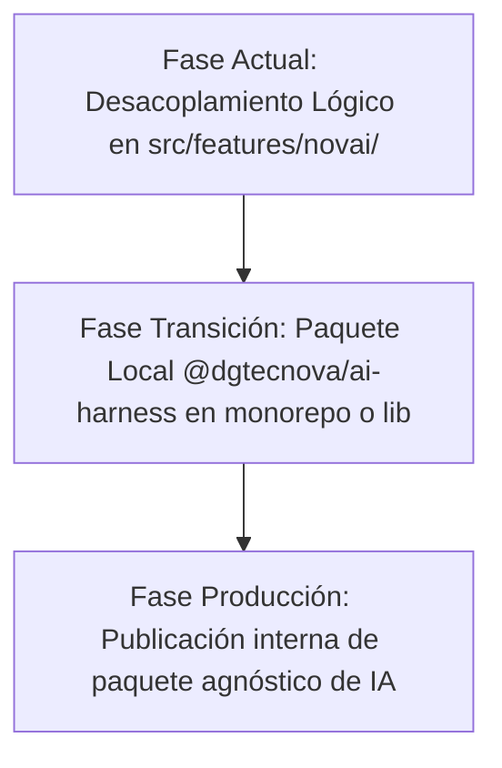

# Propuesta de Extracción Arquitectónica: DGTECNOVA AI Harness (Fase 13)

**Documento:** Propuesta de Diseño y Extracción Arquitectónica  
**Referencia:** Fase 13 — `PROMPT_NOVAI_PRO_V2.MD`  
**Fecha:** 2026-08-26  
**Estado:** Documento de Diseño / Sin Migración Prematura  

---

## 1. Objetivo

Definir la frontera conceptual y técnica para una futura extracción del **DGTECNOVA AI Harness** como paquete/módulo independiente y reutilizable a través de diferentes aplicaciones del ecosistema DGTECNOVA (ERP, CRM, NovaInvestigator, Analytics), garantizando que:

1. **Cero Migración Prematura:** El código actual permanece en `src/features/novai/` sin romper rutas, imports ni pruebas.
2. **Desacoplamiento Estricto:** La lógica de infraestructura de IA (runtime, router, presupuestos de tokens, memorias, pasarela de tools) no depende de conceptos matriciales o de negocio.
3. **Contrato de Integración Limpio:** Cualquier módulo de dominio registra sus propias herramientas mediante la interfaz estandarizada `NovaiModularTool`.

---

## 2. Inventario de Candidatos de Extracción

### 2.1 Componentes del Harness (Núcleo Agnóstico Reutilizable)

| Módulo Actual | Responsabilidad en el Harness | Dependencias Externas |
| :--- | :--- | :--- |
| `src/features/novai/events.ts` | Protocolo canónico `NovaiEvent` (SSE en JSON Lines) | Ninguna (TypeScript puro) |
| `src/features/novai/agent-runtime.ts` | Orquestador de streaming con Vercel AI SDK Core y degradación controlada | `ai`, `@ai-sdk/google`, `@ai-sdk/openai`, `@ai-sdk/groq` |
| `src/features/novai/model-router.ts` | Enrutamiento dinámico por capacidades (`supportsTools`, `supportsReasoning`, etc.) y 7 modos de operación | Ninguna (Heurística pura) |
| `src/features/novai/token-budget.ts` | Estimador y podador inteligente de historial conversacional (`trimConversationHistory`) | Ninguna (Algoritmo de ventana deslizante con anclas) |
| `src/features/novai/memory-engine.ts` | Motor de memoria multinivel (estratégica, workspace, sesión) | Supabase Client (o cualquier DB adapter) |
| `src/features/novai/tool-gateway.ts` | Pasarela de validación de riesgo y políticas Human-in-the-Loop | Sistema de Principal/Auth de la plataforma |

### 2.2 Componentes que Permanecen en el Dominio (`NovaInvestigator`)

| Componente | Justificación de Retención en Dominio |
| :--- | :--- |
| `src/utils/investigator/domain.ts` | Motor de cálculo matemático canónico de matrices EFI, EFE, DAFO y CAME. |
| `src/features/novai/evidence-engine.ts` | Auditoría de consistencia de investigaciones específicas. |
| `src/features/novai/methodology-knowledge.ts` | Axiomas estratégicos (ej. cruce crítico `D-03 × A-02`, escalas 1-2 y 3-4). |
| `src/features/novai/tools/investigations/*` | Herramientas de acceso a expedientes, factores y documentos de investigaciones. |
| `src/features/novai/tools/methodology/*` | Fachadas deterministas de auditoría y cálculo sobre investigaciones. |
| `src/features/novai/tools/strategy/*` | Linaje, comparación multicriterio y auditoría Red-Team. |

---

## 3. Matriz de Riesgos e Impacto de Extracción

| Riesgo Identificado | Severidad | Mitigación Propuesta |
| :--- | :--- | :--- |
| **Ruptura de Rutas de Import:** Mover carpetas prematuramente rompería Server Actions, Route Handlers y Vistas activas. | **Alta** | Mantener aliases de reexportación (`index.ts`) en las ubicaciones actuales durante cualquier fase de transición. |
| **Acoplamiento Oculto en Types:** Que los tipos del Harness importen tipos del dominio. | **Media** | Validado: `types.ts` del Harness solo define interfaces genéricas (`ToolMetadata`, `ToolExecutionResult`, `NovaiModularTool`). |
| **Incompatibilidad de Model Providers:** Cambios en SDKs de terceros (Groq, Gemini, OpenRouter). | **Baja** | `agent-runtime.ts` encapsula las llamadas a través de Vercel AI SDK Core (`ai`). |

---

## 4. Hoja de Ruta de Extracción Recomendada (Post-v1.0)

1. **Paso 1 (Completado):** Desacoplamiento lógico de código (Harness en runtime/router/events/gateway, Dominio en tools/methodology/investigator).
2. **Paso 2 (Futuro):** Agrupar el runtime agnóstico bajo `@dgtecnova/ai-harness` en `src/lib/ai-harness/`.
3. **Paso 3 (Futuro):** Reutilizar el Harness en otros módulos de DGTECNOVA (ERP, Facturación, Inventario, CRM).
