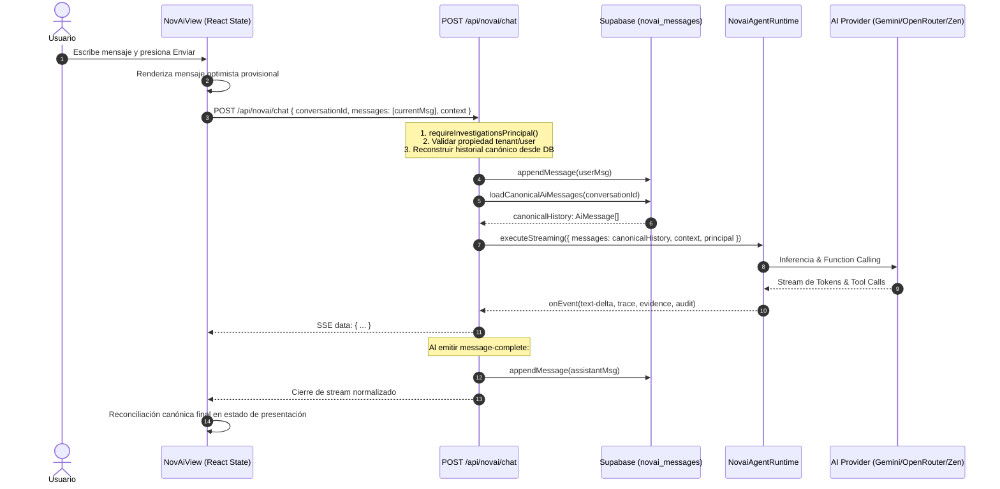

# NovAi — Conversation State Architecture V2
## Supabase como Single Source of Truth para Conversaciones y Mensajes

---

### 1. Principio Arquitectónico

NovAi y el Copiloto de IA adoptan **PostgreSQL / Supabase como la Única Fuente Canónica de Verdad (SSOT)** para:
* Identidad de conversaciones (`novai_conversations.id` generado por PostgreSQL).
* Historial canónico de mensajes (`novai_messages`).
* Orden determinista de mensajes (`created_at asc`).
* Aislamiento multi-tenant y por usuario (`tenant_id`, `user_id` bajo RLS).

```text
                    SUPABASE (PostgreSQL)
                             │
                             │ canonical
                             ▼
                  NovaiConversationsRepository
                             │
                             ▼
                      Conversation Service
                             │
              ┌──────────────┴──────────────┐
              ▼                             ▼
             UI                       Agent Runtime
       (Presentation)               (Canonical Context)
              │                             │
              └──────────────┬──────────────┘
                             ▼
                        NovAi Harness
```

---

### 2. Flujo Canónico de Chat e Inferencia



---

### 3. Eliminación de LocalStorage como Autoridad

* `localStorage` **ya no almacena** el árbol completo de mensajes ni conversaciones.
* Se conserva únicamente para preferencias de presentación del cliente (ej. `novastore:novai_active_id` para recordar el último hilo seleccionado al recargar).
* Al montar o cambiar de hilo, `NovAiView` consulta siempre `/api/novai/conversations` y `/api/novai/conversations/[id]`, garantizando cero *stale-state*.

---

### 4. Sincronización Multi-Pestaña

* Las pestañas abiertas se comunican a través del canal ligero `BroadcastChannel('novastore:novai-conversations')`.
* Eventos emitidos:
  * `refresh`: Creación, renombrado o eliminación de conversaciones.
  * `message-added`: Recepción de nuevo mensaje completado para actualizar hilos en segundo plano sin polling innecesario.

---

### 5. Idempotencia y Prevención de Duplicados

* `NovaiConversationsRepository.appendMessage` incluye verificación de deduplicación contra mensajes idénticos enviados en ráfaga (< 3s), previniendo duplicaciones por reintentos de red o doble submit.
