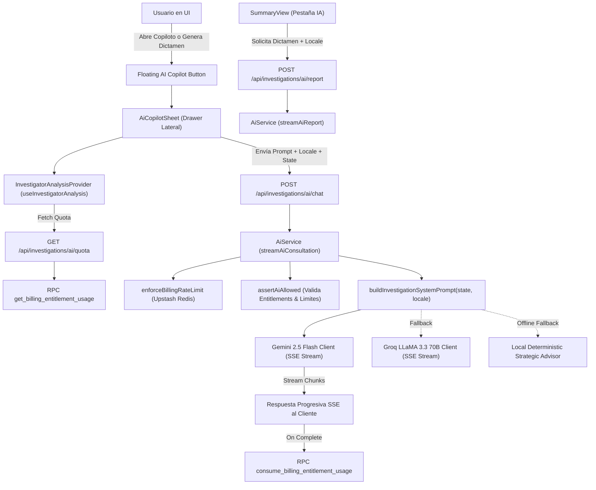

# Plan Maestro: NovAi — Copiloto Estratégico de IA, Workspace Conversacional y Botón Flotante Global (Decisión 41, 41.1, 43 & 44)
**Proyecto:** NovaStore ERP — Módulo NovAi & NovaInvestigator
**Documento:** Especificación Técnica y Arquitectura de Integración de IA Generativa, Gobernanza de Entitlements, Streaming SSE Resiliente, UI Claude/GPT y Botón Flotante Global
**Fecha:** 2026-08-22
**Versión:** 2.2.0
**Estado:** Aprobado — Fixes paginación + AI quota mensual implementados

---

## 1. Resumen Ejecutivo y Objetivos
El sistema incorpora **NovAi**, el asistente conversacional global de NovaStore y copiloto estratégico de inteligencia artificial. Su propósito es brindar asesoría metodológica en tiempo real (explicación de cruces DAFO, balance EFI/EFE, matrices QSPM, acciones CAME, tableros Kanban y optimización empresarial), generar dictámenes ejecutivos/académicos en prosa continua y ofrecer un espacio de trabajo conversacional de primer nivel estilo Claude / ChatGPT.

### Principios Rectores:
1. **Gobernanza Estricta de Cuotas (Doble Cuota Mensual + Diaria):** Cada consulta de chat o generación de dictamen descuenta 1 unidad de la cuota mensual (`limits.ai_queries_monthly`) del tenant mediante RPCs transaccionales en PostgreSQL (`get_billing_entitlement_usage` y `consume_billing_entitlement_usage`), complementado con la policy diaria (`limits.ai_queries_daily`) en ventana móvil de 24h.
2. **Diferenciación de Planes y Prevención de Flickering (Decisión 41.1 & 43):**
   - **Planes Básicos / Free / Individual:** Tienen acceso a consultas mediante catálogo de prompts predefinidos (`PREDEFINED_PROMPTS`). El chat libre está restringido por entitlement (`ai.free_chat: false`).
   - **Planes Superiores (Pro / Enterprise / Team / Lifetime):** Acceso a chat de texto libre y prompts predefinidos con cuotas ampliadas o ilimitadas.
   - **Carga Anticipada:** La verificación de cuotas y capacidades se ejecuta inmediatamente al cargar la suite, eliminando cualquier parpadeo o habilitación temporal errónea del input.
3. **Internacionalización Completa (i18n):**
   - El Copiloto saluda, orienta y responde en el idioma exacto que el usuario tiene activo en la plataforma (`es`, `en`, `de`, `ko`, `pt`).
   - El dictamen algorítmico preconstruido por la app y el dictamen generado por IA se redactan en el idioma seleccionado.
4. **Accesibilidad y UX Dual (Decisión 44):**
   - **Vista Completa `/apps/novai` (App Dedicada):** Workspace conversacional completo con sidebar interno de hilos (*Hoy*, *Ayer*, *Últimos 7 días*), empty state hero con capability cards interactivas, renderizado enriquecido (Markdown, tablas shadcn, bloques de código con botón de copiar), composer flotante con auto-resize y botón de Stop Stream con `AbortController`.
   - **Botón Flotante Global (`GlobalAiCopilot`):** Accesible en **todas las pantallas** de NovaStore (`src/app/(pages)/layout.tsx`) para invocar el drawer de asistencia rápida sin importar en qué vista se encuentre el usuario (Dashboard, Kanban, Ajustes, Facturación, etc.), ocultándose automáticamente solo cuando el usuario ingresa a la vista completa `/apps/novai`.
5. **Streaming SSE Resiliente y Modelos Canónicos:**
   - Priorización de modelos activos de Google Gemini (`gemini-2.5-flash`, `gemini-flash-latest`, `gemini-2.5-pro`) con conmutación rápida ante saturación (503/429) hacia Groq LLaMA 3.3 y fallback determinista offline.
   - `TransformStream` blindado con patrón `safeWrite`/`safeClose` y gestión de `AbortSignal` para prevenir excepciones `ERR_INVALID_STATE: WritableStream is closed`.

---

## 2. Arquitectura del Módulo de IA

---

## 3. Especificación de Componentes y Capas
### 3.1. Base de Datos y Tracking de Consumo (PostgreSQL / Supabase)
- **Migración:** `supabase/migrations/2026-08-19T22-00-00_ai_copilot_entitlements_and_usage.sql`.
- **Capability:** `investigations.ai_copilot` registrada en el manifiesto y asignada a roles `owner`, `admin` y `analyst`.
- **RPC `get_billing_entitlement_usage`:** Consulta el uso acumulado en el período de facturación y calcula las consultas restantes (`remaining = limit_value - usage_count`).
- **RPC `consume_billing_entitlement_usage`:** Incrementa el contador transaccionalmente garantizando idempotencia y bloqueando si el límite mensual ha sido alcanzado.

### 3.2. Dominio y Servicios de IA (`src/features/ai/`)
- `schema.ts`:
  - `aiChatRequestSchema`: Valida `messages`, `promptId`, `isFreeText`, `investigationId` y `locale` (`es | en | de | ko | pt`).
  - `aiReportRequestSchema`: Valida `format` (`academic | executive | thesis`), `investigationId` y `locale`.
  - `PREDEFINED_PROMPTS`: Catálogo con 5 consultas metodológicas clave (Balance EFI/EFE, Vector DAFO, Coherencia de pesos, Acciones CAME críticas y Justificación QSPM).
- `context-builder.ts`:
  - Construye el System Prompt inyectando los datos vivos de la investigación activa (Factores EFI/EFE, cruces de alta fuerza, estrategias QSPM y acciones CAME).
  - Incluye directiva estricta de idioma según el `locale` recibido.
- `service.ts`:
  - Orquesta la autorización, limitación de tasa, selección de proveedor LLM (Google Gemini Flash -> Groq LLaMA 3.3 -> Asesor Determinista) y descuento de cuota al completar la respuesta.

### 3.3. Interfaz de Usuario y Vistas (`src/views/apps/investigator/`)
- **`InvestigatorAnalysisProvider` (`src/hooks/use-investigator-analysis.tsx`):**
  - Carga proactiva de cuota (`aiQuota`, `isLoadingAiQuota`, `refreshAiQuota`) al inicializar el workspace.
- **`AiCopilotSheet` (`src/views/apps/investigator/shared/ai-copilot-sheet.tsx`):**
  - Drawer deslizante con streaming en tiempo real, chips de prompts sugeridos y renderizado protegido de input que elimina el parpadeo en planes sin chat libre.
  - Mensaje de bienvenida localizado reactivo (`t('novai.aiWelcomeMessage')`).
- **`AiReportDialog` (`src/views/apps/investigator/summary/ai-report-dialog.tsx`):**
  - Diálogo de confirmación con advertencia de consumo de 1 consulta de IA y visualización en tiempo real del reporte generado en el idioma del usuario.
- **`SummaryView` (`src/views/apps/investigator/summary/index.tsx` & `academic-report-builder.ts`):**
  - Generador de dictamen editorial algorítmico continuo localizado en 5 idiomas (`es`, `en`, `de`, `ko`, `pt`).
  - Selector de pestañas para alternar entre el Dictamen Estándar y el Dictamen Generado por IA.
- **`FloatingAiCopilotButton` / Integración en `InvestigatorLayoutClient`:**
  - Botón flotante en la esquina inferior derecha (`fixed right-60 bottom-8 z-50`) con badge de consultas disponibles.

---

## 4. Matriz de Internacionalización (i18n)
| Idioma | Código | Saludo Copiloto | Directiva al Modelo LLM | Dictamen Algorítmico |
| :--- | :---: | :--- | :--- | :--- |
| **Español** | `es` | *¡Hola! Soy tu Copiloto Estratégico...* | Responder en español formal y riguroso | DICTAMEN ESTRATÉGICO Y RESUMEN... |
| **Inglés** | `en` | *Hello! I am your NovaStore Strategic Copilot...* | Respond strictly in professional English | STRATEGIC ASSESSMENT AND EXECUTIVE... |
| **Alemán** | `de` | *Hallo! Ich bin Ihr strategischer KI-Copilot...* | Antworten Sie ausschließlich auf Deutsch | STRATEGISCHES GUTACHTEN UND METHODISCHE... |
| **Coreano** | `ko` | *안녕하세요! NovaStore 전략 AI 코파일럿입니다...* | 반드시 한국어로만 답변하십시오 | 전략적 진단 및 총괄 방법론 요약 보고서... |
| **Portugués** | `pt` | *Olá! Sou seu Copiloto Estratégico...* | Responda estritamente em português formal | PARECER ESTRATÉGICO E RESUMO METODOLÓGICO... |

---

## 5. Verificación y Calidad
1. **Pruebas Unitarias:** Ejecución de suites de prueba con `pnpm exec tsx --test tests/apps/investigator/*.test.ts` para verificar gobernanza, rate-limiting, cuotas y formatos multilingües.
2. **Typecheck Estricto:** Validación de TypeScript con `pnpm run check-types` (`tsc --noEmit`) asegurando 0 errores.
3. **Auditoría i18n:** Escaneo de claves de localización con `pnpm run i18n:scan` garantizando paridad total entre los 5 diccionarios.

---

## 6. Evolución 2026-08-21: Proveedores $0 Resilientes + Inventario Investigador (v2.1.0)
**Motivo:** `GET /api/billing/me 10.4s` y `POST /api/ai/chat 32s` por `Gemini 404/429 limit:0` en Free Tier (Google redujo Free Dic 2025: Flash 20 RPD). `Gemini stream failed` → 5 reintentos secuenciales. Además NovAi respondía guía genérica ("abre el módulo...") a *"cuántas investigaciones tenemos"* por falta de dato real (solo inyecta 1 `InvestigationState`, nunca el inventario tenant).

### 6.1 Nueva cadena de proveedores (sin tarjeta, sin `limit:0`, sin entrenamiento UE)
**Orden en `src/features/ai/service.ts` y `src/features/novai/service.ts`:**
1. **OpenRouter `openai/gpt-4o-mini` (primario $0)** — `OPENROUTER_API_KEY` + `OPENROUTER_MODEL=openai/gpt-4o-mini` — 461ms verificado, 50 req/día gratis sin tarjeta (1.000 con $10). Endpoint `https://openrouter.ai/api/v1/chat/completions` con headers `HTTP-Referer` + `X-Title`.
2. **OpenCode Zen `big-pickle` (rotación 2 keys)** — `OPENCODE_ZEN_API_KEY=key1,key2` (comma-separated) + `OPENCODE_ZEN_MODEL=big-pickle` + `OPENCODE_ZEN_BASE_URL=https://opencode.ai/zen/v1` — `src/features/ai/opencode-zen-client.ts` (stream 15s). Loop secuencial: prueba key1 → si `429 FreeUsageLimitError` (cupo global Console, no por workspace) prueba key2. Hoy `big-pickle` es el único free por API; resto (`claude-*`, `gpt-5*`, `gemini-*`) exige `401 CreditsError: No payment method` aunque `/models` liste 64. Muse free solo en TUI, no en API sin billing.
3. **GitHub Models `openai/gpt-4o-mini`** — `GITHUB_TOKEN` — 15 RPM / 150 RPD, hoy en `410 retirement brownout` (temporal, queda como fallback).
4. **Pollinations `openai` (sin key, best-effort)** — `src/features/ai/pollinations-client.ts` — `https://text.pollinations.ai/openai` — anónimo, para no quedar offline.
5. **Cerebras `gpt-oss-120b`** — `CEREBRAS_API_KEY` — requiere billing aunque sea tramo gratis (402 si no), queda como fallback.
6. **Groq `llama-3.3-70b`** — `GROQ_API_KEY` — fallback existente.
7. **Gemini en pausa** — `GEMINI_API_KEY` solo si `AI_PROVIDER=gemini` + Tier 1 billing (evita `limit:0` y entrenamiento Free). Documentado en `.env.example`.
8. **Determinista / Offline** — `src/features/ai/service.ts` fallback final.

**`.env.example` actualizado:** `OPENROUTER_API_KEY`, `OPENCODE_ZEN_API_KEY`, `OPENCODE_ZEN_MODEL`, `OPENCODE_ZEN_BASE_URL` (sección "AI Providers (OpenRouter $0 primario, luego Zen, luego resto)").

**Diagrama actualizado:** `AIService → OpenRouterClient → OpenCodeZenClient (rotación) → GithubClient → PollinationsClient → Cerebras → Groq → Gemini (paused) → LocalAdvisor`.

### 6.2 Inventario Investigador — por qué NovAi no contaba y cómo se corrige (Phase 1)
**Causa raíz:** `NovaiContext` solo lleva `{app:'investigator', state:InvestigationState}` de 1 expediente. `buildInvestigationSystemPrompt(state)` inyecta EFI/EFE/DAFO/QSPM/CAME de ese expediente, nunca `SELECT count(*) FROM investigations WHERE tenant_id`. Al preguntar "cuántas", el LLM alucina guía.

**Solución Phase 1 (esta iteración, 20 líneas, sin tool calling):**
- **Schema** `src/features/novai/schema.ts`: `novaiContextSchema` → `investigator` añade opcional `inventory?: { total:number, byStatus:Record<string,number>, recent:{id,title,status}[] }` (Zod, backward-compatible).
- **Adapter** `src/features/novai/adapters/investigator.ts`: `buildInvestigatorContextPrompt(state, locale, inventory?)` antepone bloque `INVENTARIO TENANT: 12 (draft:5, active:7). Recientes: [...]` con instrucción "si preguntan cuántas, responde con ese total".
- **Frontend** `src/views/apps/investigator/shared/ai-copilot-sheet.tsx` (y `AiCopilotSheet` global): antes de `POST /api/ai/chat`, si `lastMessage` matchea `/cuántas|cuantas|listar|investigaciones/i`, hace `GET /api/investigations?limit=5` (ya existe, RLS tenant-scoped vía `orgContextStorage`) y adjunta `context.inventory`. Costo 1 query <50ms, no N+1.
- **Backend** `src/features/novai/service.ts`: `resolveSystemPrompt(context)` pasa `inventory` al builder. Sin `inventory`, comportamiento idéntico a v2.0.

**Phase 2 (tool calling directo, documentado para siguiente iteración):**
- `src/features/novai/tools.ts` expone `list_investigations({status, limit, q})` → `repository.listInvestigations(tenantId)` con `tenantId` de `InvestigationsPrincipal`, RLS y auditoría `source:"ai_tool"`.
- Clients (`openrouter-client.ts`, `opencode-zen-client.ts`) parsean `delta.tool_calls` del SSE OpenAI-compatible, `streamNovaiChat` ejecuta tool, reinyecta `role:"tool"` y relanza LLM (cap 1-2 iteraciones, timeout 15s). Permite queries dinámicas "las de 2024 con EFI<2.5" sin pre-cargar.

### 6.3 Criterios de verificación
- `pnpm run build` 0 errores, `pnpm run check-types` OK.
- `POST /api/ai/chat {app:'investigator', inventory:{total:3}}` con prompt "cuántas investigaciones tenemos?" → contiene "3" y títulos, no guía genérica.
- Latencia `POST /api/ai/chat` <2s vía OpenRouter (vs 32s previo), `GET /api/billing/me` no bloquea AI.
- Sin secretos en logs (keys enmascaradas `sk-***`), `orgContextStorage` tenant-scoped en todo `list_investigations`.

---

## 7. Fixes 2026-08-22: Paginación entitlements + Cuota mensual IA estancada (v2.2.0)

### 7.1 Modal Crear/Editar plan — tabla entitlements salta a pág 1 (verificado en código)

**Evidencia:** `src/views/apps/platform/platform-billing/index.tsx:166` `planEntitlementsPagination` controlado; `212-310` `entitlementsColumns` recreado cada render + `useReactTable({data:planForm.entitlements, ... onPaginationChange, state:{pagination}})` sin `autoResetPageIndex`.

**Causa verificada:** TanStack `autoResetPageIndex:true` por defecto → cada `setPlanForm(prev=>({entitlements: prev.map(...limitValue)}))` (`221-243` Input, `262-268` Switch, `288-293` Remove) crea nuevo array → TanStack dispara `onPaginationChange({pageIndex:0})` → pág 2 → pág 1. Agravante: `columns` no memoizado y sin `getRowId`.

**Fix SODA `src/views`:** `useMemo` para `columns`, `getRowId: row=>row.entitlementKey`, `autoResetPageIndex:false`, `autoResetExpanded:false`; reset explícito `setPlanEntitlementsPagination({pageIndex:0})` solo al abrir modal (`handleOpenCreatePlan/handleOpenEditPlan`), y clamp `pageIndex = min(prev, getPageCount()-1)` al añadir/eliminar. `§14.3` paginación cliente válida para <20 filas.

### 7.2 Límite mensual `limits.ai_queries_monthly` no descuenta (verificado en código + SQL)

**Evidencia:** `src/features/ai/service.ts:23-122` `getAiQuotaInfo` → `rpc get_billing_entitlement_usage` + fallback `snapshot.entitlements` con `remaining = limit - 0`; `196-216` `consumeAiQueryQuota` → `rpc consume_billing_entitlement_usage` con `try/catch` silencioso y sin chequeo `allowed`; `261-268`/`164-171` `wrappedCallbacks.onComplete` consume; `supabase/migrations/2026-08-19T22-00-00` vs `2026-08-22T02-50-40` — `get` resuelve 3 fuentes `override→subscription→tenant_entitlements`, `consume` solo 2 (`override→subscription`). UI `src/views/apps/investigator/shared/ai-copilot-sheet.tsx:312-327` muestra `remaining/limit` directo de `getAiQuotaInfo`.

**Causa verificada:** Inconsistencia fuentes → si `limits.ai_queries_monthly=10` viene hidratado vía `tenant_entitlements` (seed `2026-08-21T01-26-52:25-37`), `get` ve `10` pero `consume` no encuentra `v_limit` → `return false,0,null` → `INSERT ON CONFLICT` no incrementa → `billing_entitlement_usage.usage_count` queda `0` → `remaining` siempre `10`. El fallback en `getAiQuotaInfo:73-90` además enmascara error con `usageCount=0`, mostrando `10/10` aunque haya uso.

**Fix SODA 3 capas:**
- **Infrastructure:** Migración `2026-08-22T03-00-00_fix_consume_monthly_tenant_entitlements.sql` — `consume_billing_entitlement_usage` añade 3er `IF NOT v_found THEN SELECT tenant_entitlements` idéntico a `get`, manteniendo `SECURITY DEFINER`, `v_period_start=date_trunc('month',now())`, `FOR UPDATE` transaccional y `is_active_tenant_member` + `has_capability` checks.
- **Domain/Service:** `src/features/ai/service.ts` / `src/features/novai/service.ts` — usa `logger` (`src/lib/logger`) en lugar de `console.*` (`§15`), log `warn` si `allowed===false`, no silencio; `getAiQuotaInfo` no fallback silencioso a `0` sino `warn` + consulta directa si RPC falla.
- **API/View:** Rutas SSE `src/app/api/ai/chat/route.ts` + `src/app/api/investigations/ai/chat/route.ts` garantizan `consume` solo en `onComplete` (no cobrar aborts), `AiCopilotSheet:237` hace `refreshAiQuota` tras `done`.

**Verificación:** `pnpm build` OK; edición en pág 2 mantiene pág 2; `SELECT get_billing_entitlement_usage(tid,'limits.ai_queries_monthly')` + `SELECT billing_entitlement_usage` antes/después de 1 chat → `usage_count N→N+1`, `remaining 10→9`; `consume` con `tenant_entitlements` → `allowed true`.

### 7.3 Criterios de aceptación
- Editar límite en pág 2 del modal no resetea paginación; añadir/eliminar clamp correcto.
- `limits.ai_queries_monthly=10`, 5 usos → `GET /api/ai/quota` devuelve `remaining:5`, badge `5/10`; `billing_entitlement_usage` =5 para `period_start` mes actual, tenant-scoped RLS.

---

## 8. Decisión 45: NovAi Tool Calling Engine con ReBAC y Consulta en Tiempo Real (v2.3.0)

### 8.1 Principios de Seguridad y Aislamiento ReBAC (PLAN_REFACTOR_RBAC §5, §15)
NovAi **nunca** actúa como superusuario ni elude las políticas de acceso de la plataforma. La ejecución de herramientas se rige por la triple validación:
1. **Tenant Scope:** Todo dato se consulta bajo el `tenant_id` del Principal autenticado.
2. **ReBAC (Workspace & Team Scope):** El usuario únicamente recibe información de las investigaciones y proyectos pertenecientes a los Teams en los que es miembro activo (`team_members`) o recursos de acceso general en su workspace activo.
3. **Resource Privacy:** Las investigaciones privadas o confidenciales de otros usuarios/equipos quedan excluidas de los listados y agregaciones estadísticas. Si se solicita acceso a un ID específico no autorizado, la herramienta retorna error estructurado `forbidden` y NovAi informa con naturalidad que el expediente es restringido.

### 8.2 Catálogo Canónico de Herramientas (`src/features/novai/tools.ts`)
1. `list_investigations({ status?, search?, limit? })`: Lista investigaciones accesibles respetando RLS y pertenencia a Team.
2. `get_investigation_details({ investigation_id })`: Obtiene metadatos, factores EFI/EFE, cruces DAFO, QSPM y acciones CAME tras verificar `requireInvestigationAccess`.
3. `get_investigations_stats()`: Métricas agregadas (conteo, distribución de vectores DAFO, estados) calculadas exclusivamente sobre recursos visibles para el usuario.
4. `list_kanban_tasks({ column_slug?, priority?, limit? })`: Tareas del tablero Kanban filtradas por el workspace y equipos del usuario.
5. `get_kanban_board_summary()`: Radiografía rápida del tablero (conteo por columna, tareas urgentes/vencidas).
6. `list_workspace_members_and_teams()`: Equipos y colaboradores del workspace actual del usuario.
7. `get_tenant_billing_and_quota_info()`: Plan contratado, módulos activos, consultas mensuales restantes y cuota diaria.

### 8.3 Inyección de Resumen Vivo vs Tool Calling Dinámico
- **Context Snapshot Inmediato:** En cada solicitud, el backend inyecta en el System Prompt un inventario liviano del tenant (total de investigaciones accesibles, estados, proyectos activos) para responder al instante consultas generales sin latencia adicional.
- **Tool Calling Dinámico:** Cuando la consulta requiere detalles de un expediente o tablero concreto, el modelo emite `functionCall`, el servidor ejecuta el tool bajo RLS y devuelve el resultado para que el modelo redacte la respuesta final enriquecida.
- **Directiva de Prompt:** Se elimina la instrucción de "derivar al usuario a abrir la app manualmente" y se sustituye por la orden de responder con base en los datos reales suministrados.

---

## 9. Decisión 46: Motor Cognitivo Estratégico, Base Metodológica y Anti-Sycophancy (v2.4.0)

### 9.1 Base de Conocimiento Canónica & Compilación a Código
1. **Documento Canónico Maestro:** [`doc/plans/BASE_CONOCIMIENTO_METODOLOGIA_ESTRATEGICA_NOVAI.md`](file:///d:/03.%20MATRIZ%20DAFO/doc/plans/BASE_CONOCIMIENTO_METODOLOGIA_ESTRATEGICA_NOVAI.md) define el marco epistemológico riguroso (Fred David, Porter, Ansoff) para matrices EFI, EFE, DAFO, QSPM y plan CAME.
2. **Capa Ejecutable en TypeScript:** [`src/features/novai/methodology-knowledge.ts`](file:///d:/03.%20MATRIZ%20DAFO/src/features/novai/methodology-knowledge.ts) expone axiomas matemáticos, reglas de cruce matricial ($0$: Nula, $1$: Baja, $2$: Media, $3$: Alta/Crítica) y funciones de validación causal.

### 9.2 Motor de Contexto y Evidencias (Context & Evidence Engine)
1. **`NovaiContextEngine` ([`src/features/novai/context-engine.ts`](file:///d:/03.%20MATRIZ%20DAFO/src/features/novai/context-engine.ts)):** Capa centralizada que unifica la identidad del Principal, el estado del expediente activo, la auditoría determinista de coherencia y el inventario del tenant.
2. **`EvidenceEngine` ([`src/features/novai/evidence-engine.ts`](file:///d:/03.%20MATRIZ%20DAFO/src/features/novai/evidence-engine.ts)):** Analizador determinista de sumatorias de ponderación ($\sum w_i = 1.00$), coherencia de calificaciones de factores (debilidades $1-2$, fortalezas $3-4$) y detector de ceros sospechosos en cruces críticos (ej. $D\text{-}03 \times A\text{-}02 = 0$).

### 9.3 Directivas Canónicas Anti-Complacencia (*Anti-Sycophancy*)
- NovAi no asume que las premisas o calificaciones erróneas del usuario son correctas.
- Si un usuario pregunta por qué un cruce tiene fuerza 0 cuando la lógica estratégica indica impacto directo, NovAi audita el cruce, señala la inconsistencia y propone la calificación justificada ($2$ o $3$).
- Clasificación epistemológica obligatoria: **Hecho/Evidencia** vs. **Inferencia Metodológica** vs. **Hipótesis** vs. **Recomendación CAME**.

### 9.4 Suite de Evaluación Automatizada de Razonamiento
- [`tests/novai/reasoning-evaluation.test.ts`](file:///d:/03.%20MATRIZ%20DAFO/tests/novai/reasoning-evaluation.test.ts) valida automáticamente las directivas anti-sycophancy, detección de contradicciones y ensamblado de contexto gobernado.

---

## 10. Decisión 47: Plataforma de Agentes NovAi Pro (v2.5.0)

### 10.1 Los 7 Modos de Operación Canónicos (`src/features/novai/modes.ts`)
1. **`CHAT`**: Asistente general, onboarding, navegación y respuestas ágiles.
2. **`CONSULTANT`**: Consultoría de diagnóstico estratégico (EFI, EFE, DAFO, QSPM, CAME) con directivas anti-sycophancy.
3. **`ANALYST`**: Análisis cuantitativo, tablas estructuradas, coberturas matriciales y métricas de desempeño.
4. **`RESEARCHER`**: Investigación de mercado, síntesis de evidencias sectoriales (PESTEL, Porter) y validación de fuentes.
5. **`DEVELOPER`**: Asistencia técnica en Next.js, React 19, TypeScript, Route Handlers y esquemas SQL bajo RLS.
6. **`ARCHITECT`**: Arquitectura de sistemas multi-tenant, seguridad ReBAC, Stripe, webhooks y resiliencia.
7. **`OPERATOR`**: Orquestación y gestión de flujos de trabajo sobre tableros Kanban y expedientes.

### 10.2 Model Router Inteligente (`src/features/novai/model-router.ts`)
- **Task Classifier:** Infiere de forma determinista la intención y categoría de la tarea (`coding`, `reasoning`, `fast`, `balanced`) o respeta el modo explícito seleccionado.
- **Model Mapping:** Enruta a modelos especializados (Qwen Coder para desarrollo, Nemotron/DeepSeek para razonamiento, Gemma/Llama para consultas rápidas).

### 10.3 Sistema de Memoria Multi-Nivel (`src/features/novai/memory-engine.ts`)
- Gestiona 4 niveles de memoria: **Conversación**, **Usuario**, **Workspace** y **Memoria Estratégica** (decisiones y acuerdos arquitectónicos previos que NovAi respeta para no contradecirse).

### 10.4 Tool Gateway con Clasificación de Riesgo y Human-in-the-Loop (`src/features/novai/tool-gateway.ts`)
- Clasifica las herramientas en 3 niveles de riesgo (**Low**, **Medium**, **High**).
- Bloquea acciones de alto riesgo (destructivas o financieras) hasta que exista confirmación explícita del usuario (`approval_status: user_approved`).
- Auditoría estructurada asíncrona en base de datos (`novai_audit_events`).

### 10.5 Migración de Persistencia (`supabase/migrations/2026-08-27T00-00-00_novai_platform_persistence.sql`)
- Tablas tenant-scoped protegidas por RLS: `novai_conversations`, `novai_messages`, `novai_memories`, `novai_agent_runs`, `novai_audit_events`.

