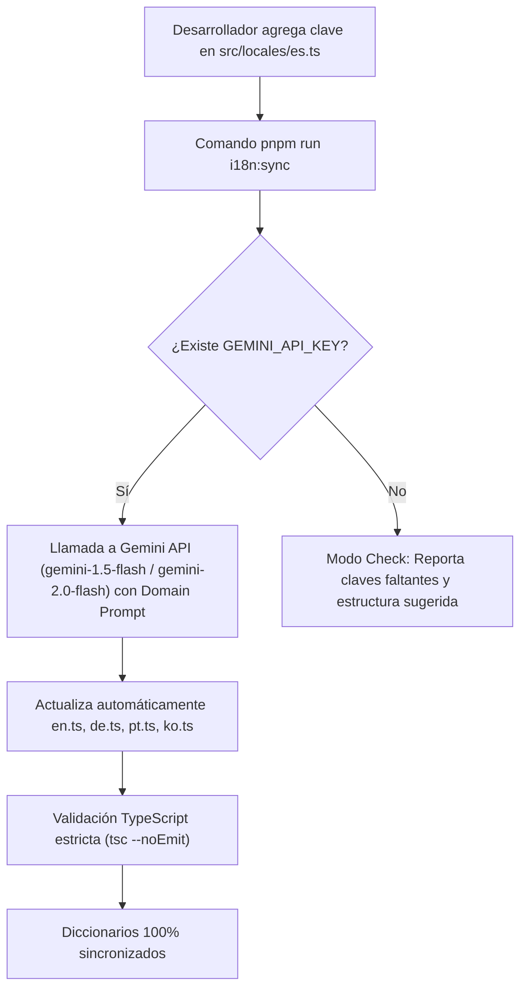

# Plan Maestro: Sistema de Internacionalización (i18n) — NovaStore ERP

**Documento:** `doc/plans/PLAN_MAESTRO_I18N_INTERNACIONALIZACION.md`  
**Fecha:** 18 de Agosto de 2026  
**Versión:** 1.0.0  
**Estado:** Listo para Implementación  
**Autor:** Antigravity AI Assistant & Engineering Team  

---

## 1. Resumen Ejecutivo y Objetivos

El presente documento define la arquitectura, diseño técnico y plan de implementación del **Sistema de Internacionalización (i18n)** para **NovaStore ERP** y su suite de aplicaciones integradas (incluyendo **NovaInvestigator**).

### 1.1 Objetivos Principales
1. **Selector Funcional e Interactivo en Navbar**: Conectar el componente visual [`src/components/shared/LanguageDropdown.tsx`](file:///d:/03.%20MATRIZ%20DAFO/src/components/shared/LanguageDropdown.tsx) para que cambie reactivamente el idioma de la plataforma.
2. **Soporte Multilingüe**:
   - 🇪🇸 **Español (`es`)** (Idioma base predeterminado).
   - 🇺🇸 **Inglés (`en`)**.
   - 🇩🇪 **Alemán (`de`)**.
   - 🇧🇷 **Portugués (`pt`)**.
   - 🇰🇷 **Coreano (`ko`)**.
3. **Persistencia Híbrida**: Guardar la preferencia del usuario en `localStorage` del cliente y en cookie `NEXT_LOCALE` para coherencia entre recargas y navegación.
4. **Cero Dependencias Pesadas Innecesarias**: Implementación nativa y ligera basada en React 19 (`Context` + hooks) y Next.js 16 App Router con tipado estricto TypeScript.
5. **Sincronización de Formatos de Región (Locale)**: Sincronizar automáticamente el locale efectivo con `CurrencyProvider`, `Intl.DateTimeFormat` e `Intl.NumberFormat` para monedas, fechas y números.

---

## 2. Arquitectura del Sistema

```mermaid
graph TD
    subgraph UI ["Capa de Presentación (UI)"]
        A["LanguageDropdown (Header)"] -->|setLocale('es' / 'en' / ...)| B["useI18n Hook"]
        C["Sidebar (Menú Lateral)"] -->|t('nav.*')| B
        D["NovaInvestigator Views"] -->|t('investigator.*')| B
        E["Dashboards & Platform"] -->|t('dashboard.*')| B
    end

    subgraph Core ["Capa de Lógica y Contexto"]
        B --> F["I18nProvider (src/hooks/use-i18n.tsx)"]
        F --> G["Traductor Tipado t(key, params)"]
        F --> H["Diccionarios (src/locales/*)"]
    end

    subgraph Storage ["Capa de Persistencia y Sincronización"]
        F -->|Persiste en cliente| I["localStorage ('novastore_locale')"]
        F -->|Persiste en cookies| J["Cookie ('NEXT_LOCALE')"]
        F -->|Actualiza formatos| K["CurrencyProvider & Intl (es-ES, en-US, etc.)"]
    end
```

---

## 3. Especificación de Componentes y Capas

### 3.1 Estructura de Diccionarios (`src/locales/`)

Los diccionarios se organizarán por archivos TypeScript modulares y tipados bajo `src/locales/`:
- `src/locales/es.ts`: Diccionario base en español (fuente canónica de tipos).
- `src/locales/en.ts`: Diccionario en inglés.
- `src/locales/de.ts`: Diccionario en alemán.
- `src/locales/pt.ts`: Diccionario en portugués.
- `src/locales/ko.ts`: Diccionario en coreano.
- `src/locales/index.ts`: Exportador central, definición de tipos `Locale`, `TranslationKey` y metadatos de idiomas.

#### Namespaces de Traducción:
1. **`common`**: Textos genéricos (`save`, `cancel`, `edit`, `delete`, `search`, `filter`, `loading`, `error`, `readOnlyMode`, `actions`, `back`, `close`).
2. **`nav`**: Menús de navegación (`dashboard`, `investigations`, `projects`, `users`, `roles`, `pricing`, `billing`, `settings`, `administration`, `apps`).
3. **`investigator`**: Módulo NovaInvestigator (`context`, `summary`, `efi`, `efe`, `dafo`, `qspm`, `came`, `manager`, `factors`, `strengths`, `weaknesses`, `opportunities`, `threats`, `strategies`, `sessionLocked`, `realtimeSync`).
4. **`dashboard`**: Paneles de control (`title`, `strategicOverview`, `activeInvestigations`, `closedInvestigations`, `recentActivity`, `factorsDistribution`).
5. **`billing`**: Facturación y planes (`plans`, `subscriptions`, `invoices`, `trial`, `upgrade`, `enterprise`, `pro`, `starter`).
6. **`auth`**: Autenticación (`login`, `logout`, `email`, `password`, `welcome`, `sessionExpired`).

---

### 3.2 Contexto y Hook de Internacionalización (`src/hooks/use-i18n.tsx`)

#### Definición de Tipos
```typescript
export type SupportedLocale = 'es' | 'en' | 'de' | 'pt' | 'ko'

export interface LanguageMeta {
  code: SupportedLocale
  name: string
  nativeName: string
  flag: string
  bcp47: string
}

export interface I18nContextValue {
  locale: SupportedLocale
  setLocale: (locale: SupportedLocale) => void
  t: (key: string, params?: Record<string, string | number>) => string
  languages: LanguageMeta[]
  currentLanguage: LanguageMeta
}
```

#### Flujo de Resolución del Idioma Inicial:
1. Valor en `localStorage.getItem('novastore_locale')`.
2. Si no existe, valor de la cookie `NEXT_LOCALE`.
3. Si no existe, coincidencia con el idioma del navegador (`navigator.language`).
4. Fallback por defecto: `'es'` (Español).

---

### 3.3 Integración con el Selector de Idiomas (`src/components/shared/LanguageDropdown.tsx`)

El dropdown se conectará directamente a `useI18n()`:
- Mostrará la bandera y el nombre nativo de cada idioma:
  - 🇪🇸 **Español** (`es`)
  - 🇺🇸 **English** (`en`)
  - 🇩🇪 **Deutsch** (`de`)
  - 🇧🇷 **Português** (`pt`)
  - 🇰🇷 **한국어** (`ko`)
- Indicará visualmente el idioma seleccionado mediante un check/radio item activo.
- Al seleccionar una opción, se invocará `setLocale(value)`, actualizando todos los textos de la interfaz sin refresco forzado del navegador.

---

### 3.4 Conexión con `Header.tsx` y `Sidebar.tsx`

1. **Header ([`src/components/layout/Header.tsx`](file:///d:/03.%20MATRIZ%20DAFO/src/components/layout/Header.tsx))**:
   - El botón trigger del `LanguageDropdown` mostrará el icono `<LanguagesIcon />` junto con un tooltip o indicador del idioma actual.
2. **Sidebar ([`src/components/layout/Sidebar.tsx`](file:///d:/03.%20MATRIZ%20DAFO/src/components/layout/Sidebar.tsx))**:
   - Las etiquetas de grupos (`Dashboard`, `Apps`, `Administration`) y de elementos de menú (`Investigations`, `Projects`, `Users`, `Roles`, etc.) consumirán `t('nav.*')` de forma reactiva.
3. **Providers ([`src/components/Providers.tsx`](file:///d:/03.%20MATRIZ%20DAFO/src/components/Providers.tsx))**:
   - Envolver el árbol de componentes con `<I18nProvider>` en la raíz.

---

## 5. Pipeline de Traducción Automática Continua (`i18n-sync`)

Para garantizar que cualquier texto nuevo incorporado al software en el futuro se traduzca de forma desatendida y homogénea, se establece el siguiente pipeline de sincronización asistida por IA:



### 5.1 Especificación del Script `scripts/i18n-sync.ts`
- **Fuente de la verdad**: `src/locales/es.ts` (Namespace + Claves en Español).
- **Destinos**: `src/locales/en.ts`, `src/locales/de.ts`, `src/locales/pt.ts`, `src/locales/ko.ts`.
- **Domain Prompting**:
  > *"Eres un traductor experto en software empresarial SaaS ERP y formulación estratégica metodológica (matrices DAFO/SWOT, EFI/IFE, EFE, QSPM y CAME/TOWS). Traduce las siguientes claves respetando las variables de interpolación `{variable}`, siglas técnicas y formato JSON/TypeScript."*
- **Variables de Entorno**: `GEMINI_API_KEY` en `.env.local`.
- **Scripts en `package.json`**:
  - `pnpm run i18n:sync`: Detecta e inyecta traducciones automáticas en los 4 idiomas.
  - `pnpm run i18n:check`: Verifica en CI/CD que no existan claves huérfanas sin traducir.

---

## 6. Cobertura de Componentes y Vistas del Sistema

### 6.1 Módulo NovaInvestigator
1. **`FactorEditor` y `RatingScale` (`src/views/apps/investigator/shared/factor-editor.tsx`)**:
   - Cabeceras de tabla: `Código`, `Nombre del factor`, `Tipo`, `Peso`, `Calif.`, `Puntaje`, `Fuente de evidencia y técnica`, `Acciones`.
   - Botones: `Normalizar pesos a 1.00`, `Añadir Fortalezas/Debilidades/Oportunidades/Amenazas`, `Mover arriba/abajo`, `Eliminar`.
   - Leyenda de calificaciones 1 a 4 para factores internos y externos.
   - Subtotales y sumas de verificación en pie de tabla.
2. **`InvestigatorContextView` (`src/views/apps/investigator/context/index.tsx`)**:
   - Formulario reactivo con etiquetas y placeholders traducidos (`Título de la investigación`, `Organización`, `Unidad analizada`, `Autor`, `Fecha`, `Problema`, `Objetivo`, `Supuestos`).
3. **`InvestigatorManagerView` (`src/views/apps/investigator/investigations/index.tsx`)**:
   - Estados de sincronización (`cargando`, `guardando`, `sincronizado`, `solo memoria`, `error`), acciones de tarjeta y diálogos modales.
4. **`InvestigatorDashboardView` (`src/views/dashboards/investigations/`)**:
   - Indicadores KPI, Matriz de Posicionamiento IE, Gráficos de distribución de factores y acciones CAME, tabla de expedientes recientes y resumen.

### 6.2 Componentes Compartidos y de Perfil
1. **`ProfileDropdown` (`src/components/shared/ProfileDropdown.tsx`)**:
   - `Mi Cuenta` (`My Account`), `Configuración` (`Settings`), `Cerrar Sesión` (`Logout`), `Sesión de invitado` (`Guest session`).

---

## 7. Plan de Verificación y Testing

| Tipo de Prueba | Herramienta | Alcance |
| :--- | :--- | :--- |
| **Integridad de Diccionarios** | Node.js Test Runner (`tests/i18n/use-i18n.test.ts`) | Verifica que los 5 diccionarios implementen el 100% de las claves del schema sin nulos ni cadenas vacías. |
| **Tipado Estricto** | `tsc --noEmit` | Valida que todos los diccionarios cumplan la interfaz `TranslationSchema`. |
| **Persistencia** | Pruebas de integración | Comprueba almacenamiento en `localStorage` y cookie `NEXT_LOCALE`. |
| **Sincronización Automática** | `scripts/i18n-sync.ts` | Valida detección diferencial de claves y llamada a la API de Gemini. |

---

## 8. Plan de Implementación Paso a Paso

| Paso | Tarea | Archivos Afectados |
| :--- | :--- | :--- |
| **1** | Crear diccionarios y metadatos en 5 idiomas | `src/locales/es.ts`, `src/locales/en.ts`, `src/locales/de.ts`, `src/locales/pt.ts`, `src/locales/ko.ts`, `src/locales/index.ts` |
| **2** | Crear Proveedor y Hook `useI18n` | `src/hooks/use-i18n.tsx` |
| **3** | Registrar `I18nProvider` en la raíz de la app | `src/components/Providers.tsx` |
| **4** | Actualizar `LanguageDropdown.tsx` con soporte real | `src/components/shared/LanguageDropdown.tsx` |
| **5** | Integrar `t()` en `Header.tsx` y `Sidebar.tsx` | `src/components/layout/Header.tsx`, `src/components/layout/Sidebar.tsx` |
| **6** | Integrar `t()` en el Dashboard y Gestor de Investigaciones | `src/views/dashboards/investigations/index.tsx`, `src/views/apps/investigator/investigations/index.tsx` |
| **7** | Crear suite de pruebas unitarias para i18n | `tests/i18n/use-i18n.test.ts` |
| **8** | Ejecutar verificación de tipos y tests | `tsc --noEmit`, `pnpm test` |

---

## 5. Criterios de Aceptación y Validación

1. **Persistencia**: Al seleccionar un idioma, recargar la página mantiene el idioma elegido.
2. **Reactividad Inmediata**: Al cambiar de idioma en el dropdown de la barra superior, todos los textos de navegación y menús se traducen al instante sin recarga de página.
3. **Fallback Robusto**: Si una clave no existe en un idioma específico, se utiliza el texto en español como fallback sin lanzar excepciones ni romper la interfaz.
4. **Calidad y Estabilidad**:
   - `pnpm exec tsc --noEmit` compila con 0 errores.
   - `pnpm test` pasa el 100% de las pruebas unitarias e integración.
